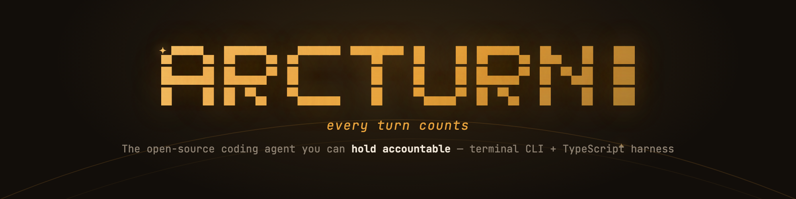
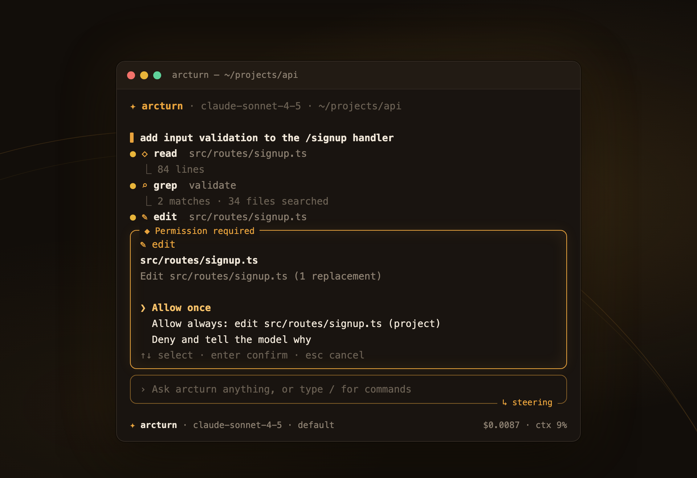

<div align="center">



<br/>

[](https://www.npmjs.com/package/arcturn)
[](LICENSE)
[](https://nodejs.org)
[](https://github.com/sitharaj88/arcturn/actions/workflows/ci.yml)

**[arcturn.dev](https://arcturn.dev)** · [Getting started](https://arcturn.dev/docs/getting-started) · [Docs](https://arcturn.dev/docs) · [SDK](https://arcturn.dev/sdk) · [Security](https://arcturn.dev/security) · [Blog](https://arcturn.dev/blog)

</div>

---

An agent now edits files in your working tree, runs shell commands, and spawns sub-agents
that do both again with their own budgets. The interesting question stopped being *can it
write the code?* It is **can I let it?** — and twenty minutes later, *what exactly did it
do?*

Arcturn is an open-source terminal coding agent and the TypeScript harness underneath it,
built around those two questions:

- **Every tool call clears a permission engine** before it runs — rules, scopes, modes.
- **Every file edit is snapshotted first** — `/rewind` restores files *and* forks the
  conversation back to any earlier turn.
- **Every session is a file on disk** you can replay, bisect, and blame back to the exact
  tool call that made a change.
- **Reviewers in multi-agent pipelines structurally cannot merge code** — not a prompt
  asking nicely, an execution lane that discards their diffs by construction.

<div align="center">

<br/>
<sub>The permission gate, mid-session: the agent wants to edit a file, and the next keystroke is yours.</sub>
</div>

## Install

```bash
npm install -g arcturn
```

Node 20 or newer. `pnpm add -g arcturn` and `bun add -g arcturn` work the same way;
`npx arcturn` runs it without installing.

```bash
export ANTHROPIC_API_KEY=sk-ant-...   # or OPENAI_API_KEY, GOOGLE_API_KEY, ...
cd your-project
arcturn                                # interactive TUI
arcturn -p "explain this repo"         # one-shot: run, print, exit
arcturn -p "..." --output-format json  # NDJSON event stream, for programs
```

## What's in the box

### 🛡 Permission engine

Rule-based allow/deny/ask decisions resolved across session, project, and user scopes,
with four modes — `default`, `plan`, `acceptEdits`, `yolo`. **Deny beats `yolo`, always**
— that ordering is what lets a workflow confine a role to its worktree, and why the rules
and the sandbox compose instead of fighting. Path matching folds case on case-insensitive
filesystems — probed at runtime, not assumed from the platform, because `.ENV` should not
walk past a `**/.env` deny rule on macOS.

```jsonc
// .arcturn/config.json
{
  "permissions": [
    { "tool": "bash", "specifier": "npm *", "action": "allow", "scope": "project" },
    { "tool": "read", "specifier": "**/.env", "action": "deny", "scope": "project" }
  ]
}
```

### 🔒 A cloned repo runs none of its own code until you say so

`<repo>/.arcturn` can declare lifecycle hooks, a `verify` command, extensions and
stdio MCP servers — all of which run **as you**, and a `sessionStart` hook runs before
you have typed anything. Arcturn asks once, in a prompt that names every command and
file, and refuses by default. Off a terminal — `--print`, CI, `serve`, `acp` — there is
nobody to ask, so the answer is no: the run still completes, and says on stderr exactly
what it did not run and the three ways to approve it.

The approval covers the project's **contents**, not its path. Editing `src/`, a README
or a skill never re-asks; adding a hook, changing any file under `extensions/`, or
declaring an MCP server does. Your own `~/.arcturn` hooks and extensions are never
gated — that is the difference between a gate and a nuisance.

```console
$ arcturn trust --list      # exactly what this project would run
$ arcturn trust --allow     # approve it for these contents
$ arcturn -p "..." --trust-project   # CI that already trusts the checkout
```

Known edges are documented rather than implied: a hook command is a pointer into your
shell, so Arcturn cannot see what the files it invokes will contain later. See
[`docs/integration-notes/INTEGRATION-project-trust.md`](docs/integration-notes/INTEGRATION-project-trust.md).

### ⏪ Checkpoints & `/rewind`

Every edit is snapshotted before it lands. `/rewind` restores the files **and** forks the
conversation back to that turn — the session is a tree, not a list, so the branch you
rewound away from still exists. `/rewind <query>` jumps by intent.

### 🎞 Sessions you can replay, bisect, and blame

Sessions persist as JSONL trees. `arcturn replay` re-runs one hermetically,
`arcturn bisect` finds the turn where behaviour changed against a recorded cassette, and
`arcturn blame` traces any file change back to the session, turn, and tool call that made
it. Cost and token usage ride the same stream — `--max-cost 2.00` is a hard abort, not a
suggestion.

### 🤖 Workflows & agent organizations

A numbered markdown file is a multi-stage pipeline. `@role` dispatches a step to a named
markdown agent with its own model, tools, and turn ceiling:

```markdown
---
name: ship-fix
budgetUsd: 15
---
1. @qa-functional Write a regression test that FAILS against the current code: {{input}}
2. @developer Make it pass. Repro: {{prev}}
3. - @qa-adversarial Try to break the fix from a fresh reading of the diff. {{prev}}
   - @security-reviewer Audit the change for anything a hostile caller could exploit. {{prev}}
4. @tech-lead Assemble the evidence packet. Do not merge anything yourself. {{prev}}
```

Three dispatch lanes decide what a role can touch, derived from its **tools**, never from
its description: `read` (no worktree), `exec` (isolated worktree, diff **always**
discarded), `write` (worktree, diff captured and applied). A reviewer cannot land code —
`bash` is a write primitive wearing a read costume, and the lane knows it. Worktrees are
seeded with the run's already-applied patches, so reviewers read what the pipeline
actually produced, not untouched `HEAD`.

Runs are journalled and **resumable**: `/workflow status` shows what an interrupted run
reached and its spend; `/workflow resume` re-enters it, replaying completed steps rather
than paying for them twice, and probing every recorded patch with
`git apply --check --reverse` so nothing lands twice. A role that hits real ambiguity
emits `ORG-ASK:` and the whole run **pauses for a human answer**, then continues exactly
where it stopped. Per-run `budgetUsd:` and per-step `stepTimeoutMs:` ceilings bound the
two things that actually run away.

A runnable ten-role, six-pipeline enterprise kit ships in
[`kits/enterprise-org/`](kits/enterprise-org/), documented alongside an honest
account of what is enforced and what is still convention.

### 🔌 MCP, both directions

Connect stdio and HTTP Model Context Protocol servers (OAuth 2.1 included) and their
tools, resources, and prompts just work. Or invert it: `arcturn mcp-serve` exposes
Arcturn **as** an MCP server so another agent can drive it — read-only by default, behind
a workspace boundary enforced by permission rule *and* a physical path check, with the
peer assumed hostile. The boundary's audit trail is public: see
[the security page](https://arcturn.dev/security).

### 🌐 Multi-provider, honestly labelled

| Provider | Verified against a live endpoint |
|---|---|
| Anthropic (Messages API) | ✅ |
| OpenAI — Chat Completions *and* Responses API | ✅ |
| Google Gemini | ✅ |
| Any OpenAI-compatible endpoint | ✅ |
| Any Anthropic-compatible endpoint | ✅ |
| AWS Bedrock · Vertex AI · Azure OpenAI | ⚠️ implemented, not yet verified live |

Streaming, tool calls, thinking, prompt caching, and cost tracking across all of them.
"Verified" means a real request to the real endpoint: streaming, a tool call answered on
a second turn, and cost accounting checked against published rates —
[the story of why that column exists](https://arcturn.dev/blog/three-providers-three-bugs)
is worth two minutes. A per-event idle timeout (not a duration cap) means a slow but
progressing stream is never killed while a stalled one is. `/model refresh` queries each
provider's own model list and merges newly released models without touching curated
entries.

### 🔍 Code search without an embedding service

A BM25 + structural index over the workspace powers a `search_code` tool that finds code
by meaning. Nothing leaves your machine.

### 🧠 Context engineering

Automatic compaction, context editing, tool-output offloading, and deferred tool schemas
loaded on demand via `tool_search` — a long session stays inside the window without
silently dropping what mattered.

### 🧰 And the rest of a working day

Built-in tools (`read`, `write`, `edit`, `bash` with background execution, `grep`,
`glob`, `ls`, `fetch`, `websearch` via Brave or DuckDuckGo) · LSP diagnostics appended to
every edit (TypeScript, Python, Go, Rust) · markdown skills as slash commands with no
build step (`.arcturn/skills`, frontmatter, `$ARGUMENTS`) · lifecycle hooks that can veto
a `preToolUse` call · fuzzy `@file` mentions with image attachment · plan mode and
structured todos living in the session tree · sub-agents, `/team`, `/scout`, and `/bg`
for parallel work · an opt-in OS sandbox confining `bash` writes to the workspace · full
light/dark theming down to the terminal canvas itself (OSC 11) · live cost and context
meters in the status bar.

## Embed it: the SDK

The CLI is a consumer of `@arcturn/core` — everything it does, your program can do:

```ts
import { createAgent } from "@arcturn/core";
import { createClient, requireModel } from "@arcturn/ai";
import { createDefaultTools } from "@arcturn/tools";

const llm = createClient(); // resolves API keys from the environment
const { tools } = createDefaultTools({ cwd: process.cwd() });

const agent = createAgent({
  llm,
  model: requireModel("anthropic/claude-sonnet-4-5"),
  systemPrompt: "You are a focused, careful coding agent.",
  tools,
  cwd: process.cwd(),
  sessionDir: ".arcturn/sessions",
  permissions: { mode: "default" },
});

agent.subscribe((event) => {
  if (event.type === "toolEnd") console.log(event.result.isError ? "✗" : "✓", event.toolCallId);
});

await agent.prompt("Add input validation to the signup handler");
console.log(agent.finalText());
```

One `Agent` per session, options in, events out — the same event stream the TUI renders
and the CLI prints as NDJSON. Start at the [SDK docs](https://arcturn.dev/docs/sdk).

## Packages

| Package | Description |
|---------|-------------|
| `arcturn` | The interactive coding agent, workflow engine, and agent-org runtime |
| [`@arcturn/core`](https://www.npmjs.com/package/@arcturn/core) | Agent runtime: event loop, steering, sessions, compaction, permissions, sub-agents |
| [`@arcturn/ai`](https://www.npmjs.com/package/@arcturn/ai) | Unified multi-provider LLM streaming client with model catalog and retry |
| [`@arcturn/types`](https://www.npmjs.com/package/@arcturn/types) | Zero-dependency shared contracts (messages, events, tools, permissions, sessions) |
| `@arcturn/tools` | Built-in tools: read, write, edit, bash (+background), grep, glob, ls, fetch |
| `@arcturn/mcp` | Model Context Protocol client bridge — internal, API may change in any release |
| `@arcturn/tui` | Terminal UI library with differential rendering — internal, API may change in any release |
| `@arcturn/index` | Token-optimized code index and BM25 semantic search — internal, API may change in any release |
| `@arcturn/protocol` | NDJSON wire protocol for server mode — internal, API may change in any release |
| `@arcturn/server` | WebSocket server exposing agent sessions — internal, API may change in any release |
| `@arcturn/evals` | Task-level eval harness (in-repo only, not published) |

`@arcturn/types`, `core`, `index`, and `protocol` carry **no external runtime
dependencies at all** — nothing in the layer that decides whether a tool call runs comes
from outside this repository.

## Documentation

**[arcturn.dev/docs](https://arcturn.dev/docs)** — 44 pages: a
[CLI reference](https://arcturn.dev/docs/cli-reference) for every flag and slash command,
[permissions](https://arcturn.dev/docs/permissions),
[workflows](https://arcturn.dev/docs/workflows),
[agent organizations](https://arcturn.dev/docs/agent-organizations),
[the SDK](https://arcturn.dev/docs/sdk), and the
[security limits page](https://arcturn.dev/security) that states every control's known
edges as content, not fine print.

From the blog, the three stories that explain the project's temperament:
[Why I built an agent harness you can audit](https://arcturn.dev/blog/why-arcturn) ·
[Three providers, three bugs, under two cents](https://arcturn.dev/blog/three-providers-three-bugs) ·
[Reviewers who cannot merge](https://arcturn.dev/blog/reviewers-who-cannot-merge)

## Platform support

Arcturn runs on **macOS**, **Linux**, and **Windows** — CI builds and tests all three on
Node 20 and 22 (`.github/workflows/ci.yml`). Windows differences worth knowing:

- The `bash` tool and lifecycle hooks run commands through `%ComSpec%` (`cmd.exe` by
  default), not a POSIX shell, so agent-authored commands with POSIX idioms
  (`&&`-chained builtins, `$(...)`, single-quoted strings) may not run as written.
- The opt-in `sandbox: "workspace-write"` filesystem sandbox is macOS (`sandbox-exec`) and
  Linux (`bwrap`) only; on Windows it runs unconfined and says so explicitly rather than
  silently claiming confinement.
- Windows support is newer than macOS/Linux. If you hit a rough edge, **WSL2** is the
  smoothest path to the same POSIX shell and sandbox this project runs on day to day.

## Development

```bash
git clone https://github.com/sitharaj88/arcturn.git
cd arcturn
pnpm install
pnpm build     # build all packages
pnpm check     # lint + typecheck
pnpm test      # run all tests
```

Node.js ≥ 20 and pnpm ≥ 10 required. See [PLAN.md](PLAN.md) for architecture, the status
ledger, and the roadmap — including the corrections, which stay in the record rather than
getting laundered out of it.

Issues and pull requests are welcome. The engineering bar to know about up front: fixes
land with a regression test that was **verified to fail first**, and claims of
verification are reserved for things that have actually run.

---

## 👤 Author

**Sitharaj Seenivasan**

- 🌐 Website: [sitharaj.in](https://sitharaj.in)
- 💼 LinkedIn: [sitharaj08](https://www.linkedin.com/in/sitharaj08)
- 💻 GitHub: [sitharaj88](https://github.com/sitharaj88)

## ☕ Support

If this project helps you, consider buying me a coffee — it keeps the work going.

[](https://buymeacoffee.com/sitharaj88)

## 📄 License

Licensed under the [Apache License 2.0](LICENSE). © 2026 Sitharaj Seenivasan.
